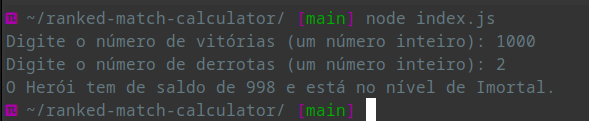

# 🌟 Calculadora de Partidas Rankeadas

**Este projeto calcula o saldo de vitórias e classifica o jogador em um nível com base nas vitórias que ele possui.** O programa solicita ao usuário o número de vitórias e derrotas, calculando o saldo e determinando o nível do jogador.

## 📋 Pré-requisitos

Antes de executar o projeto, você precisa ter o **Node.js** instalado em seu sistema. Este guia é focado em **Manjaro Linux**. Para instalar o Node.js, execute o seguinte comando no terminal:

```bash
sudo pacman -S nodejs npm
```

## 🚀 Instalação

Siga os passos abaixo para configurar o projeto em **Manjaro Linux**:

1. **Clone o repositório**:
   ```bash
   git clone git@github.com:henriquejsza/ranked-match-calculator.git
   ```

2. **Navegue até o diretório do projeto**:
   ```bash
   cd ranked-match-calculator
   ```

3. **Instale as dependências do projeto**:
   ```bash
   npm install
   ```

## 💻 Como Executar o Projeto

Para executar a calculadora de partidas ranqueadas, utilize o seguinte comando:

```bash
node index.js
```

### 🛠️ Instruções

- Ao executar o comando, o programa solicitará que você insira o número de vitórias.
- Em seguida, será solicitado que você forneça o número de derrotas.
- O programa exibirá o saldo de vitórias e o nível do jogador com base nas vitórias informadas.

## 📊 Exemplo de Saída Esperada

Após inserir os dados, a saída será semelhante a esta:

```plaintext
Digite o número de vitórias: 85
Digite o número de derrotas: 10
O Herói tem de saldo de 75 e está no nível de Diamante.
```

---

## 🖼️ Imagem de Saída Esperada




---

## 🤝 Contribuição

Contribuições são bem-vindas! Sinta-se à vontade para abrir problemas (issues) e solicitar recursos (pull requests).

## 🎓 Bootcamp

Este projeto foi desenvolvido como parte do bootcamp **GFT Start #6 - Lógica de Programação**. Você pode conferir mais sobre o bootcamp [aqui](https://www.dio.me/bootcamp/gft-start-logica-de-programacao).
